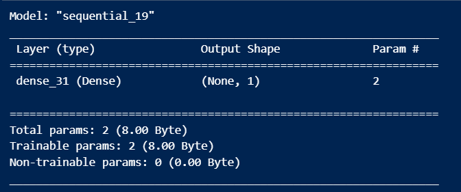

13-01-2024
- Tensor:- Someway of representing information into numbers.
- What we are going to cover:-
    - TensorFlow basics & fundamentals
    - Preprocessing data (getting it into tensors)
    - Building and using pretrained deep learning models
    - Fitting a model to the data(learning patterns)
    - Making predictions with a model(using patterns)
    - Evaluating model predictions
    - Saving and loading models
    - Using a trained model to make predictions on custom data

- TensorFlow model workflow:-
    1. Get data ready (turn into tensors).
    2. Build or pick a pretrained model(to suit your problem).
    3. Fit the model to the data and make a prediction.
    4. Evaluate the model.
    5. Improve through experimentation.
    6. Save and reload your trained model.

- How to approach this course:-
    - Write code (lots of it, follow along , let's make mistakes together)
        - Motto #1: "If in doubt, run the code"
    - Explore & experiment
        - Motto #2:"Experiment, experiment, experiment"
        - Motto #3:"Visualize, visualize, visualize" (recreate things in ways you can understand them).
    - Ask questions (including the dumb ones)
    - Do the exercises (try them yourself before looking at the solutions)
    - Share your work
    - Avoid (strictly):-
        - Overthinking the process
        - The "I can't learn it" mentality.

- What we've created so far:
    - Scalar: a single number
    - Vector: a number with direction(e.g. wind speed and direction)
    - Matrix: a 2-dimensional array of numbers
    - Tensor: an n-dimensional array of numbers (when n can be any number, a 0-dimensional tensor is a scalar, a 1-dimensional tensor is a vector)

15-01-2024
- tf.random.set_seed(42): this sets random seed at global level
- tf.random.shuffle(not_shuffled, seed=42): this sets random seed at operational level i.e. only for specific operation.

17-01-2024
| Attribute | Meaning | Code |
| --- | --- | --- |
| Shape | The length(number of elements) of each of the dimensions of a tensor. | tensor.shape | 
| Rank | The number of tensor dimensions. A scalar has rank 0, a vector has rank 1, a matrix is rank 2, a tensor has rank n | tensor.ndim |
| Axis or dimension | A particular dimension of a tensor | tensor[0], tensor[:. 1]...|
| Size | The total number of items in the tensor | tf.size(tensor) |
 

19-01-2024
- Matrix multiplication is called as dot product i.e elements of rows get multiplied with columns

20-01-2024
- tf.tensordot(a, b, axes) :- Tensordot (also known as tensor contraction) sums the product of elements from a and b over the indices specified by a_axes and b_axes.

21-01-2024
(Neural Network Regression with TensorFlow)
- What we're going to cover
    - Architecture of a neural network regression model
    - Input shapes and output shapes of a regression model (features and lables)
    - Creating custom data to view and fit
    - Steps in modelling
        - Creating a model, compiliing a model, fitting a model, evaluating a model
    - Different evaluation methods
    - Saving and loading models
    
24-01-2024
Steps in modelling with TensorFlow

1. Creating a model - define the input and output layers, as well as the hidden layers of a deep learning model.

2. Compiling a model - define the loss function and the optimizersand evaluation metrics.
    * Loss - how wrong your model's predictions are compared to the truth labels(you want to minimise this).
    * Optimizer - how your model should update its internal patterns to better its predictions.
    * Metrics - human interpretable values for how well your model is doing.

3. Fitting a model - letting the model try to find patterns between X & y (features and labels).
    * Epochs - how many times the model will go through all of the training examples.

4. Evaluate the model on the test data (how reliable are our model's predictions?)

25-01-2024
**Improving our model**

We can improve our model, by altering the steps we took to create a model.

1. **Creating a model** - here we might add more layers, increase the number of hidden units (all called neurons) within each of the hidden layers, change the activation function of each layer.

2. **Compiling a model** - here we might change the optimization funciton or perhaps the **learning rate** of the optimization function.
 
3. **Fitting a model** - here we might fit a model for more **epochs** (leave it training for longer) or on more data (give the model more examples to learn from).

**Common way to improve a deep learning model:**
- Adding layers
- Increase the number of hidden units
- Change the activation functions
- Change the optimization function
- **Change the learning rate**
- Fitting on more data
- Fitting for longer

**Evaluating a model**
When it comes to evaluation there are 3 words you should memorize:
`Visualize, visualize , visualize`

It's good idea to visualize:
* The data - what data are we working with? What does it look like?
* The model itself - what does our model look like?
* The training of a model - how does a model perform while it learns?
* The predictions of the model - how do the predictions of amodel line up against the ground truth (the original labels)?

* Total params - total number of parameters in the model.
* Trainable parameters - these are the parameters(patterns) the model can update as it trains.
* Non-trainable params - these parameters aren't updated during training (this is typical when you bring in already learn patterns or parameters from other models during transfer learning)

26-01-2024
- There are two main formats we can save our model's too:
1. The SavedModel format
2. The HFF5 (.h5)

04-02-2024
| Scaling type | What it does | Scikit-Learn Function | When to use |
| --- | --- | --- | --- |
| Scale  (also referred to as normalisation) | Converts all values to between 0 and 1 while preserving the original distribution | MinMaxScaler | Use as default scaler with neural networks.|
| Standardization | Removes the mean and divides each value by the standard deviation. | StandardScaler | Transform a feature to have close to normal distribution (caution: this reduces the effect of outliers). |

06-02-2024
** Neural Network Classificaiton in TensorFlow**

What we're going to cover
* Architecture of ea neural network classifacation model
* Input shapes and output shapes of a classification model (features and labels)
* Creating custom data to view and fit
* Steps in modelling
    - Creating a model, compiling a model, fitting a model, evaluating a model
* Different classification evaluation method
* Saving and loading models

07-02-2024

A classification is where you try to classify something as one thing or another.

A few types of classification problems:
* Binary classification
* Multiclass classification
* Multilabel classification

10-02-2024

To find the ideal learning rate (the learning rate where the loss decreases the most during training) we're going to use the following steps:

* A learning rate **callback** - you can think of a callback as an extra piece of functionality, you can add to your *while* its training.
* Another model (we could use the same one as above, but we're practicing building models here)
* A modified loss curves plot.

**Learning rate scheduler** - At the beginning of every epoch, this callback gets the updated learning rate value from schedule function provided at __init__, with the current epoch and current learning rate, and appliees the updated learning rate on the optimizer.

** Classification evalution methods **

| Metric Name | Metric Formula | Code | When to use |
| -- | -- | -- | -- | 
| Accuracy | Accuracy=tp+tn/tp+tn+fp+fn | tf.keras.metrics.Accuracy() or sklearn.metrics.accuracy_score() | Default metric for classification problems. Not the best for imabalanced classes. |
| Precision | Precision=tp/tp+fp | tf.keras.metrics.Precision() or sklearn.metrics.precision_score() | Higher precision leads to less false positives. |
| Recall | Recall=tp/tp+fn | tf.keras.metrics.Recall() or sklearn.metrics.recall_score() | Higher recall leads to less false negatives. |
| F1-score | F1-score=2 * ((Precision * Recall) / Precision + Recall) | sklearn.metrics.f1_score() | Combination of precision and recall, usually a good overall metric for a classification model. |
| Confusion matrix | NA | Custom funcion or sklearn.metrics.confusion_matrix() | When comparing predictions to truth labels to see where model gets confused. Can be hard to use with large numbers of classes. |

### Anatomy of a confusion matrix
* True positive = model predicts 1 when truth is 1
* True negative = model predicts 0 when truth is 0
* False positive = model predicts 1 when truth is 0
* False negative = model predicts 0 when truth is 1

----------------------------------------Classification Completed---------------------------------------------------------

**Computer Vision with Tensorflow**

What we're going to cover
* Getting a dataset to work with 
* Architecture of a convolutional neural network (CNN) with TensorFlow
* An end-to-end binary image classification problem
* Steps in modelling with CNNs
    * Creating a CNN, compiling a model, fitting a model, evaluating a model
* An end-to-end multi=class image classification problem
* Making predictions on our own custom images.

*Computer Vision*:- Computer vision is the practice of writing algorithms which can discover patterns is visual data. Such as the camera of a self-driving car recognizing the car in front.

22-02-2024
Breakdown of Conv2D layer

| Hyperparameter name | What does it do? | Typical values |
| -- | -- | -- |
| Filters | Decides how many filters should pass over an input tensor (e.g. sliding windows over an image). | 10, 32, 64, 128 (higher values lead to more complex models) |
| Kernel size (also called filter size) | Determines the shape of the filters (sliding windows) over the output. | 3, 5, 7 (lowes values learn smaller features, higher values learn larger features) |
| Padding | Pads the target tensor with zeroes (if "same") to preserve input shape. Or leaves in the target tensor as is (if "valid), lowering output shape. | "same" or "valid" |
| Strides | The number of steps a filter takes across an image at a time (e.g. if strides=1, a filter moves across an image 1 pixel at a time). | 1(default), 2 |

* Max Pooling : Downsamples the input representation by taking the maximum value over the window defined by *pool_size* for each dimension along the features axis. The window is shifted by *strides* in each dimension. The resulting output when using "valid" padding option has a shape(number of rows or columns) of: `output_shape=(input_shape - pool_size + 1)/strides`

The resulting output shape when using the "same" padding option is:
`output_shape=input_shape/strides`

For example, for stride=(1,1) and padding="valid"

23-04-2024
Data Augmentation :- Data augmentation is the process of altering our training data, leading it to have more diversity and in turn allowing our models to learn more generalizable (hopefully) patterns. Altering might mean adjusting the rotation of an image, flipping it, cropping it or something similar.

**Improving a model**
| Method to improve a model (reduce overfitting) | What does it do? |
| -- | -- |
| More data | Gives a model more of a chance to learn patterns between samples (eg. if a model is performing poorly on images of pizza, show it more images of pizza) |
| Data augmentation | Increase the diversity of your training dataset without collecting more data (eg. take your photos of pizza and randomly rotate them 30 degree). Increased diversity forces a model to learn more generalizable patterns. |
| Better data | Not all data samples are created equally. Removing poor smaples from or adding better samples to your dataset can improve your model's performance. |
| Use transfer learning | Take a model's pre-learned patterns from one problem and tweak them to suit your own problem. For example, take a model trained on pictures of cars to recognise pictures of trucks. |

05-03-2024
Learned about TensorFlow SSD

13-03-2024
Transfer Learning started

**What is transfer learning?**
It is a technique where a model trained on one task is reused or adapted as the starting point for training a model on different but related task. It leverages knowledge gained from the source task to improve learning and performance on the target task especially when the target task has limited labeled data available.

**Why use transfer learning?**
* Can leverage an existing neural network architecture proven to work on problems similar to our own.
* Can leverage a working network architecture which has already learned patterns on similar data to our own (often results in great results in great results with less data)

**What we're going to cover**
* Introduce transfer learning with TensorFlow
* Using a small dataset to experiment faster (10% of training samples)
* Building a transfer learning feature extraction model with TensorFlow Hub
* Use TensorBoard to track modelling experiments and results

17-03-2024
**Setting up callbacks (things to run while our model trains)
Callbacks are extra funcitonality you can add to your models to be performed during or after training. Some of the most popular callbacks:

* Tracking experiments with the TensorBoard callback
* Model checkpoint with the ModelCheckpoint callback
* Stopping a model from training (before it trains too long and overfits) with the EarlyStopping callback

**What are callbacks?**
* Callbacks are a tool which can add helpful functionality to your models during training, evaluation or inference
* Some popular callbacks include:

| Callback name | Use case | Code |
| -- | -- | -- |
| TensorBoard | Log the performance of multiple models and then view and compare these models in a visual way on TensorBoard (a dashboard for inspecting neural network parameters). Helpful to compare the results of different models on your data. | tf.keras.callbacks.TensorBoard() |
| Model checkpointing | Save your model as it trains so you can stop training if needed and come back to continue off where you lef. Helpful if training takes long time and can't be done in one sitting. | tf.keras.callbacks.ModelCheckpoint() |
| Early stopping | Leave your model training for an arbitrary amount of time and have it stop training automatically when it ceases to improve. Helpful when you've got a large dataset and don't know how long training will take. | tf.keras.callbacks.EarlyStopping() |

20-03-2024
- Learned about TensorFlow Hub and the pretrained TensorFlow model which can be used for transfer learning.

23-03-2024
## Different types of transfer learning
- transfer learning - using an existing model with no changes what so ever.
- "Feature extraction" transfer learning - use the prelearned patterns of an existing model (e.g. EfficientNetB0 trained on ImageNet) and adjust the output layer for your own problem (e.g. 1000 classes -> 10 classes of food)
- "Fine-tuning" transfer learning - use the prelearned patterns of an existing model and "fine-tune" many or all of the underlying layers (including new output layers)

26-03-2024
`Transfer Learning (fine tuning) started`

**What we're going to cover**

* Introduece fine-tuning transfer learning with TensorFlow
* Introduce the Keras Functional API to build models
* Using a small dataset to experiment faster (e.g. 10% of training samples)
* Data Augmentation (making your training set more diverse without adding samples)
* Running a series of experiments on our Food Vision data
* Introduce the ModelCheckpoint callback to save intermediate training results in resumable checkpoints.

06-04-2024
**Note**:- One of the reasons feature extraction transfer learning is named how it is because what often happens is pretrained model outputs a feature vector (a long tensor of numbers which represents the learned representation of the model on a particular sample, in our case, this is the output of the `tf.keras.layers.GlobalAveragePooling2D()` layer) which can then be used to extract patterns out of for our own specific problem.

07-04-2024

**Adding data augmentation right into the model**
To add data augmentation right into our models, we can use the layers inside:

* tf.keras.layers.experimental.preprocessing()

10-04-2024

**What are callbacks?**
- Callbacks are a tool which can add helpful functionality to your models during trianing, evaluation or inference.
- Some popular callbacks include:

| Callback name | Use case | Code |
| -- | -- | -- | 
| TensorBord | Log the performance of multiple models and then view and compare these models in a visual way on TensorBoard (a dashboard for inspecting neural network parameters). Helpful to compare the results of different models on your data. | tf.keras.callbacks.TensorBoard() |
| Model checkpointing | Save your model as it trains so you can stop training if needed and come back to continue off where you left. Helpful if training takes a long time and can't be done in one sitting. | tf.keras.callbacks.ModelCheckpoint() |
| Early stopping | Leave your model training for an arbitrary amount of time and have it stop training automatically when it ceases to improve. Helpful when you've got a large dataset and don't know how long training will take. | tf.keras.callbacks.EarlyStopping() |

19-04-2024
- Transfer Learning in TensorFlow : Fine Tuning (part two) is completed.

22-04-2024
**Transfer Learning Part 3: Scaling Up started**

What we're going to cover
- Downloading & preparing 10% of all Food101 classes(7500+ training images)
- Training a transfer learning feature extraction model
- Fine-tuning our feature extraction model(Food Vision mini) to beat the original Food101 paper with only 10% of the data.
- Evaluating Food Vision mini's predictions
    - Finding the most wrong predictions (on the test dataset)
- Making predictions with Food Vision mini on our own custom images

05-05-2024
- evaluating model's performance using confusion matrix for 101 classes of food.

10-05-2024

Finding the most wrong predictions
* A good way to inspect your model's performance is to view the wrong predictions with highest prediction probability (or highest loss)
* Can reveal insights such as:
    * Data issues (wrong labels, e.g. model is right, label is wrong)
    * Confusing classes (get better/more diverse data)

To find out where our model is most wring, let's write some code to find out the following:
1. Get all of the image file paths in the test dataset using list_files() method
2. Create a pandas DataFrame of the image filepaths, ground truth labels, predicted classes (from our model), max prediction probabilities, prediction class names, ground truth class names.
3. Use our DataFrame to find al the wrong predictions (where the ground truth label doesn't match the prediction).
4. Sort the DataFrame based on wrong predictions (have the highest prediciton probability predictions at the top).
5. Visualize the images with the highest prediciton probabilities but have the wrong prediction.

11-05-2024
Transfer Learning

12-05-2024
What we're going to cover:
- TensorFlow dataset 
- Training and fine-tuning big model with 100% data

14-05-2024

What is TensorFlow Datasets (TFDS)?
TensorFlow Datasets is a place for prepared and ready-to-use machine learning datasets.

* Why use TensorFlow Datasets?
    * Load data already in tensor format
    * Practice on well established datasets (for many different problem types)
    * Experiment with different modelling techniques on a consistent dataset
* Why not use TensorFlow Datasets?
    * Datasets are static (don not change like real-world datasets)

code:
(train_data, test_data), ds_info = tfds.load(name="food101",
                                             split=["train", "validation"],
                                             shuffle_files=True,
                                             as_supervised=True,
                                             with_info=True)

23-05-2024
* `layer.name` : the human readable name of a particular layer
* `layer.trainable`: is the layer trainable or not? (if False, the weights are frozen)
* `layer.dtype`: the data type a layer stores its variables in
* `layer.dtype_policy`: the data type policy a layer computes on its variables with

26-05-2024
Milestone project 1 food vision is completed

29-05-2024
NLP in TensorFlow is started 

What we're going to cover
* Downloading and preparing a text dataset
* How to prepare text data for modelling (tokenization and embedding)
* Setting up multiple modelling experiments with recurrent neural networks (RNNs)
* Building a text feature extraction model using TensorFlow Hub
* Finding  the most wrong prediction examples
* Using a model we've built to make predictions on text from the wild

`NLP` : NLP has the goal of deriving information out of natural language (could be sequences of text or speech).
Another common term for NLP problems is sequence to sequence problems (seq2seq).

02-06-2024

Tokenization vs Embedding

* Tokenization - straight mapping from token to number (can be modelled but quickly gets too big)

* Embedding - richer representation of relationships between tokens (can limit size + can be learned)

03-06-2024
### Converting text into numbers

When dealing with a text problem, one of the first things you'll have to do before you can build a model is to convert your text to numbers.

There are a few ways to do this, namely:
* Tokenization - direct mapping of token (a token could be a word or a character) to number
* Embedding - create a matrix of feature vector for each token (the size of the feature vector can be defined and this embedding can be learned)

Note:- Embedding is best to convert text into numbers and it also converts meaningfully into numbers which is machine readable.

04-07-2024

To recreate a model the same as a some previous model you've created you can use the `tf.keras.models.clone_model()`